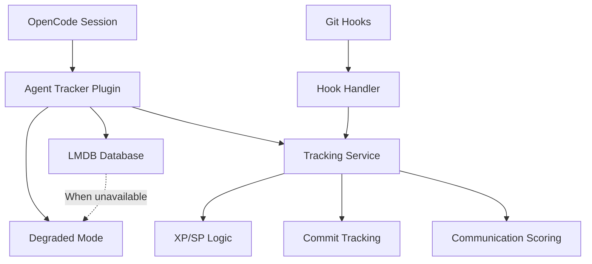

# Architecture Overview

## System Design



## Core Components

### 1. Plugin Entry Point (`src/index.ts`)
- Initializes LMDB database
- Sets up event handlers
- Handles graceful degradation
- Registers custom tools

### 2. LMDB Database (`src/lmdb-database.ts`)
- Memory-mapped file storage
- ACID transaction support
- Optimized for high concurrency
- Error handling & fallback mechanisms

### 3. Tracking Service (`src/tracking-service.ts`)
- XP calculation logic
- SP level-up algorithms  
- Commit validation & tracking
- Performance benchmarking

### 4. Event Handlers (`src/event-hooks.ts`)
- OpenCode event interception
- Real-time tracking updates
- Error recovery mechanisms
- Performance monitoring

## Database Schema

### Key Structure
```typescript
// Prefix-based key strategy
agent:${agent_id}           // Agent tracking data
commit:${project}:${hash}   // Commit-level metrics
communication:${hash}       // Retrospective scoring
```

### Data Models
```typescript
interface AgentData {
  id: string
  name: string
  model: string
  scope: string
  skill_points: number
  experience_points: number
  communication_score: number
  total_commits: number
  total_bugs: number
  active: boolean
  created_at: Date
  updated_at: Date
}

interface CommitData {
  agent_id: string
  commit_hash: string
  project_path: string
  task_description: string
  experience_gained: number
  timestamp: Date
}
```

## Performance Characteristics

### LMDB Advantages
- **Memory-mapped files**: OS-level performance optimization
- **Zero-copy reads**: Direct memory access without serialization
- **Lock-free reads**: Concurrent access without blocking
- **ACID transactions**: Guaranteed data integrity

### Expected Performance
- >1M operations/second for LMDB reads
- ~100K operations/second for complex transactions
- Sub-millisecond response times for git hooks

## Error Handling Strategy

### Graceful Degradation
```typescript
// When LMDB unavailable
if (!db.available) {
  console.warn("Agent tracker running in degraded mode")
  return degradedTools // Basic functionality only
}
```

### Failure Modes
- **LMDB Unavailable**: Continue with basic tracking disabled
- **Database Corruption**: Reset database with backup recovery
- **Plugin Errors**: Log errors but don't crash OpenCode

## Integration Points

### OpenCode Hooks
```typescript
// Critical tracking hooks
"tool.execute.after"    // Track successful tool usage
"command.executed"      // Track command completion
"session.created"       // Initialize agent tracking
"session.idle"         // Save final metrics

// Optional hooks
"tool.execute.before"  // Agent validation for commits
"experimental.session.compacting" // Session summary
```

### Git Hooks Integration
- `pre-commit`: Validate agent registration
- `post-commit`: Track commit completion
- Custom hooks for performance monitoring

## Security Considerations

### Data Protection
- LMDB files stored in user's home directory
- No external API calls or data transmission
- Local-only operation for privacy

### Access Control
- Plugin runs with user permissions
- No escalation of privileges
- Clear boundaries between OpenCode and plugin

## Scalability Considerations

### Multiple Agents
- Support for concurrent agent sessions
- Lock-free access patterns
- Efficient querying across agent data

### Large Projects
- Optimized for projects with many commits
- Efficient storage and retrieval patterns
- Minimal memory overhead